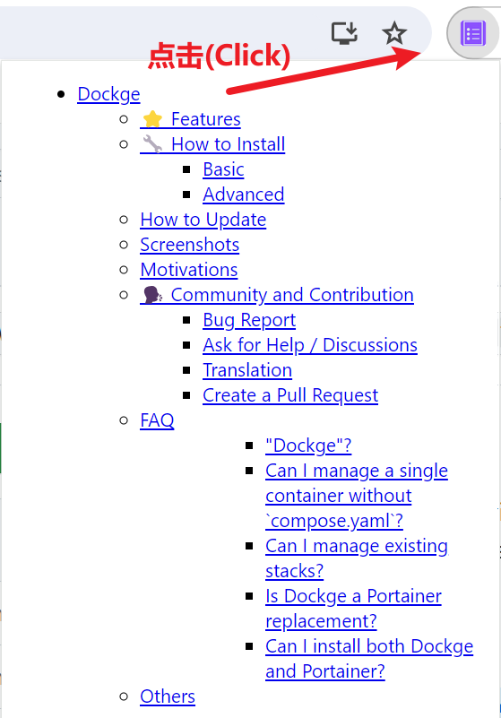

## Github项目页自动生成目录（Chrome网页插件）

-------

## 1. 简介

在查看Github某个项目的Readme文档时，我发现目前Github对Readme的标题大小不够明显，很难区分不同层级的标题。当遇到某个项目的Readmd文档很长的时候，Github目前也未提供目录显示，因此本项目旨在解决Github项目Readme文档自动目录，方便用户阅读。

## 2. 使用

- Clone本项目，此时你将获得一个文件夹。

- 在Chrome浏览器中进入：[拓展程序管理chrome://extensions/](chrome://extensions/)，打开**开发者模式**，点击**加载已解压的拓展程序**，在弹出的文件选择器中选中刚才Clone的文件夹。

- 进入任意Github开源项目（比如这个：[开源项目](https://github.com/rongchenlin/BiliBili-Lucky-Draw)），然后点击插件，即可使用。

## 3. 效果

